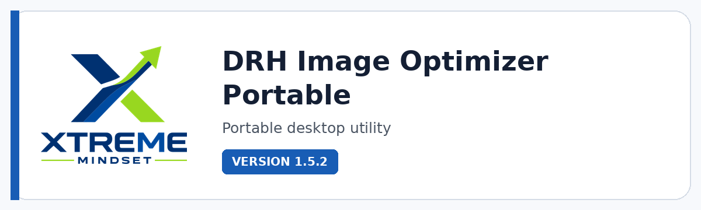

# DRH Image Optimizer Portable

**Fast, portable image optimization and conversion for Windows, from drag-and-drop batches to controlled GUI and CLI workflows.**

  

  

---

## Overview

DRH Image Optimizer Portable is built for people who need smaller, cleaner image assets without turning optimization into a separate production step. It combines native Windows portability, batch processing, format conversion, metadata control, safe replacement, and resilient long-path handling in one compact utility.

Use it for web assets, documentation, presentations, product images, 3D pipelines, archives, or any workflow where file size matters but reliability matters just as much. The GUI is designed for fast visual operation, while the console engine and drop-target launchers make repeatable batch work easy to automate.

## Get the current build

This product is shared directly with supporters instead of through a public download link. [Support development on Ko-fi](https://ko-fi.com/pacosalasv) and include **the product name and the email address where you want to receive it** in your message. I will send the current available build directly.

Direct distribution keeps access personal, connects product feedback with active users, and gives supporters a simple route to the current build without hunting through mirrors or outdated packages.

## Key features

- **Lossless, Smart, and Ultra workflows** for choosing the right balance between preservation and size reduction.
- **Wide input coverage** including PNG, JPEG/JFIF, GIF, BMP/DIB, TIFF, WebP, SVG, ICO, AVIF, HEIC, and HEIF when the required Windows/browser decoder is available.
- **Keep format, Automatic, and PNG output modes** so the output strategy matches the job instead of forcing one format.
- **Native GUI plus standalone console engine** for interactive work, scripted workflows, and repeatable batch processing.
- **Metadata controls** for supported JPEG and PNG structures, including optional stripping when privacy or delivery size matters.
- **Safe final replacement and rollback** designed to protect existing destinations if the final write fails.
- **Temporary per-image workspaces** that improve resilience with deep paths, different volumes, and intermediate files.
- **Responsive batch processing** with progress percentage, capped visual logs, and persistent CSV reporting.

## Standout tools and workflows

| Tool / workflow | Why it matters |
|---|---|
| **Lossless** | Preserve decoded pixel content while optimizing compatible PNG/JPEG-family files. |
| **Smart** | Prioritize practical size reduction with controlled visual trade-offs for everyday production work. |
| **Ultra** | Push harder on optimization when delivery size matters most. |
| **Drop-here workflows** | Launch common optimization modes directly from dedicated batch files. |
| **Metadata control** | Remove supported metadata when a cleaner, leaner delivery file is preferred. |
| **Safe replace + rollback** | Commit final output carefully and restore the previous destination when recovery material is available. |
| **GUI + CLI** | Move between point-and-click use and automation without changing tools. |

## Product status

| Item | Details |
|---|---|
| Status | **Current release** |
| Version | 1.5.2 |
| Product type | Portable desktop utility |
| Platform | Windows x64 |
| Best for | Batch optimization, conversion, delivery assets, repeatable image workflows |

## Media

Additional screenshots and workflow examples are coming soon.

## Documentation and support

| Resource | Link |
|---|---|
| Current build | [Request supporter access](https://ko-fi.com/pacosalasv) |
| Support guide | [SUPPORT.md](SUPPORT.md) |
| Repository changelog | [CHANGELOG.md](CHANGELOG.md) |
| Issues | [Open or review issues](https://github.com/pacosalasv/DRH_Image_Optimizer_Portable-Support/issues) |
| Discussions | [Ask questions and share feedback](https://github.com/pacosalasv/DRH_Image_Optimizer_Portable-Support/discussions) |

## Support development

If this tool saves you time, Ko-fi support helps fund maintenance, compatibility work, documentation, testing, and continued development.

  

## Ecosystem

| Destination | Link |
|---|---|
| Supporter access | [Request the current build on Ko-fi](https://ko-fi.com/pacosalasv) |
| Issues & feedback | [GitHub Issues](https://github.com/pacosalasv/DRH_Image_Optimizer_Portable-Support/issues) |
| Xtreme Mindset | [Product lab](https://xtrememindset.blogspot.com/) |
| Paco Salas \| DRH | [Official site](https://pacosalasv.blogspot.com/) |
| DRH Blender tools | [BlendKit catalog](https://www.blendkit.com/?query=author_id:205846) |
| Sketchfab / Código Píxel | [3D model collections](https://sketchfab.com/codigopixel/collections) |
| KreaOn | [Technology education](https://www.kreaon.com/) |
| PiNu | [Connected physical products](https://pinu.com.mx/) |
| GitHub | [pacosalasv](https://github.com/pacosalasv) |

## License

DRH Image Optimizer Portable is released under the **MIT License**.
